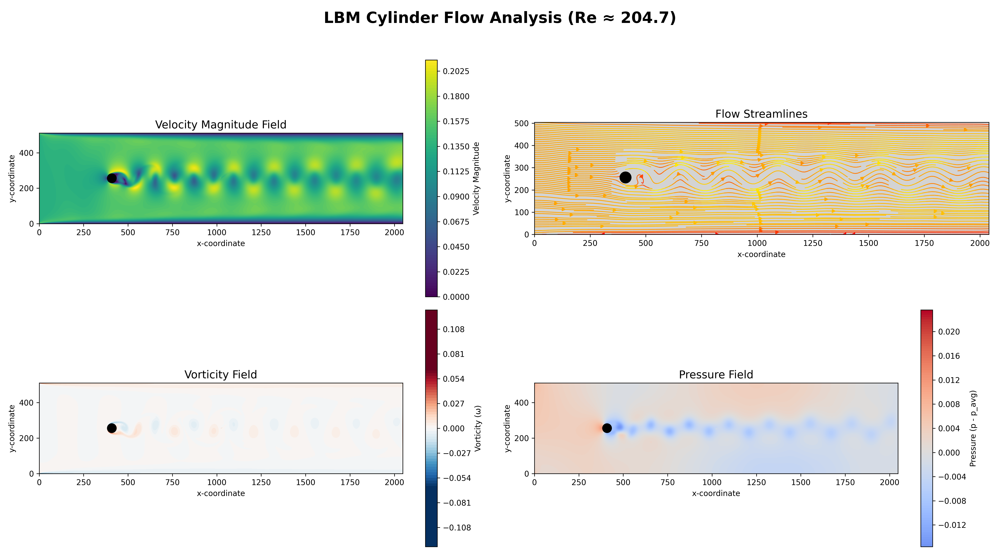

# HighPerformanceComputing-LatticeBoltzmannMethod

## High-Performance D2Q9 LBM Solver with Hybrid MPI/OpenMP Parallelism for 2D Cylinder Flow

[](https://en.wikipedia.org/wiki/C%2B%2B20)
[]()
[]()

---

## 1. Project Overview

This project is a massively parallel, highly optimised C++ solver for simulating two-dimensional, incompressible fluid flow around a circular cylinder. It uses the **Lattice Boltzmann Method (LBM)** with the **D2Q9 Bhatnagar-Gross-Krook (BGK)** collision operator.

The solver is engineered for **High-Performance Computing (HPC)** environments, capable of scaling across distributed clusters to resolve complex, unsteady flow features like the von Kármán vortex street.

| Feature                 | Implementation |
|:------------------------| :--- |
| **Numerical Model**     | D2Q9 BGK Lattice Boltzmann Method |
| **Parallelism**         | **Hybrid MPI** (Distributed) + **OpenMP** (Shared Memory) |
| **Vectorisation**       | Explicit **AVX2/FMA** Intrinsics (`_mm256d`) |
| **Boundary Conditions** | Zou-He (Inlet/Outlet) & Bounce-Back (Walls/Cylinder) |

---

## 2. Hybrid Parallelism Model

The solver achieves high scalability by employing a hybrid parallel strategy optimised for modern supercomputing clusters:

### MPI (Distributed Memory)
* **Domain Decomposition:** The global grid is partitioned into a 2D Cartesian topology using `MPI_Cart_create`.
* **Ghost Cell Exchange:** Efficient, non-blocking communication (`MPI_Isend` / `MPI_Irecv`) is used to exchange boundary populations between neighbouring ranks.
* **Global Reduction:** Force statistics and stability checks are aggregated across all nodes using `MPI_Reduce` and `MPI_Allreduce`.

### OpenMP (Shared Memory)
* **Thread-Level Parallelism:** Within each MPI rank, OpenMP parallelizes the intense `collision_step` and `streaming_step` loops using `#pragma omp parallel for collapse(2)`.
* **Data Locality:** The schedule is static to maximise cache locality and minimise thread overhead.

---

## 3. Low-Level Optimisation

To maximise computational throughput on commodity CPUs, the core kernels are heavily optimised:

* **SIMD Vectorisation:** The equilibrium distribution function calculation is explicitly vectorised using **AVX2 intrinsics** (e.g., `_mm256_mul_pd`, `_mm256_add_pd`). This allows four double-precision floating-point operations to occur simultaneously per cycle.
* **Memory Alignment:** Distribution arrays (`f_current`, `f_next`) are allocated with **`alignas(32)`** to ensure alignment with 256-bit AVX registers, preventing expensive unaligned load penalties.
* **Structure of Arrays (SoA) Layout:** The data layout is optimised to ensure contiguous memory access during the collision step, reducing cache misses.

---

## 4. Results and Analysis

### Flow Field Animation
The simulation captures the transition of the flow regime as the Reynolds number increases. The solver outputs VTK files that visualise the formation of the wake.

<p>
    
    <br>
    <small><i>Evolution of the flow field: Starting from initial stable flow at <b>Re=50</b>, transitioning through the onset of instability at <b>Re=100</b>, and developing into a full <b>von Kármán vortex street at Re=200</b>.</i></small>
</p>

### Quantitative Validation
The solver's accuracy is validated against physical benchmarks using the included Python scripts:

1.  **Strouhal Number ($St$):** Calculated by analysing the oscillation frequency of the Lift Coefficient ($C_L$).
   * **Result:** $St \approx 0.22$ (matches expected range for Re ≈ 200).
2.  **Force Coefficients:** Drag ($C_D$) and Lift ($C_L$) are computed in real-time using the **momentum exchange method** on the cylinder boundary.

<p>
    
</p>

---

### Development History

This project evolved from a prior phase focused on analytical validation and micro-optimisation. The initial **Poiseuille Channel Flow** solver:
* Validated the LBM model against the analytical parabolic velocity profile (RMSE $\approx 0.003$).
* Was used to benchmark the effectiveness of **SIMD (AVX2)** vectorisation, yielding a measured $1.08\times$ total speedup.

You can view this original code, including the analytic validation plots, in the separate [`Poiseuille`](https://github.com/lgmoak/HighPerformanceComputing-LatticeBoltzmannMethod/tree/Poiseuille) branch.

## 5. Quick Start Guide

### Requirements
* **C++20** Compiler (GCC/Clang)
* **MPI** Implementation (OpenMPI, MPICH)
* **OpenMP**
* **CMake** 3.10+
* **Python 3** (for visualisation: `numpy`, `matplotlib`, `pandas`, `scipy`, `seaborn`)

### Build Instructions

```bash
# 1. Clone the repository
git clone [https://github.com/lgmoak/HighPerformanceComputing-LatticeBoltzmannMethod.git](https://github.com/lgmoak/HighPerformanceComputing-LatticeBoltzmannMethod.git)
cd HighPerformanceComputing-LatticeBoltzmannMethod

# 2. Create build directory
mkdir build && cd build

# 3. Configure and Build (Release mode for -O3 optimisations)
cmake -DCMAKE_BUILD_TYPE=Release ..
cmake --build . -j$(nproc)
```
### Running the Simulation

To run the solver using 4 MPI processes (for example):

```bash
# Run from the build directory
mpirun -np 4 ./bin/lbm_solver
```
### Visualisation
```bash
cd ..
# Generate 4-panel flow analysis plot
python scripts/visualise_results.py

# Calculate Strouhal number and plot Lift Coefficient
python scripts/lift.py
```
